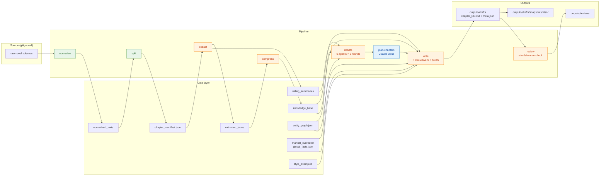

<div align="center">

# Continuator

**A multi-agent LLM pipeline for long-form novel continuation, built with engineering discipline.**

[English](README.md) · [简体中文](README.zh.md)

[](https://www.python.org/)
[](#status)
[](docs/iterations/)
[](https://github.com/BerriAI/litellm)
[](#quick-start)

</div>

---

## TL;DR

Read a published novel → build a structured knowledge base → debate the continuation direction with 6 agents → plan N chapters with a strong reasoner → write each chapter with a cheap fast model → 8-reviewer quality gate → measured cost & quality.

**Not** "yet another GPT wrapper." The interesting part is the **engineering scaffold around the LLM**: 15 iterations of mock-first development, real-model validation, preflight guardrails, prompt-cache-aware writer, entity graph for relationship consistency, per-call cost telemetry.

Validated on 《龙族》 (Dragon Raja, by 江南) as test corpus — 5 volumes, 2.3M source characters. Latest measured chapter: **4507 Chinese characters, user-rated 8/10, $0.42 per chapter.**

> The source novel itself is gitignored. This repo ships the engine, not the corpus.

---

## Why this might catch your eye

| Layer | What it looks like in code |
|---|---|
| **Mock-first dev** | 135 unit tests, **runs in 3 seconds** without burning a single token. `tests/__init__.py` force-sets `OPENAI_MODEL=mock` to prevent `.env` leakage. |
| **Preflight guardrails** | 7 categories of FATAL checks before any real-model call: env / context limit / agents config / rolling state / manifest integrity / **provider routing** / manual facts. |
| **Cost telemetry** | Every call logs `request_hash`, prompt/response tokens, cache_read/cache_write tokens. `estimate-cost` aggregates with provider-specific pricing. |
| **Chunked extraction** | Chapters >24k chars split front/middle/end; **all-or-nothing merge** so no half-baked summaries. |
| **Structured debate** | 6 agents × 6 rounds + structured ballot with `position: agree/abstain/reject`. Majority aggregation with tie/multi-reject markers. Empty-ballot fallback path. |
| **Entity graph w/ timeline** | Characters/locations/concepts as entities. Relationships carry `timeline[]` with `active=true` markers. **Writer sees only active state**; a "relationship consistency" reviewer agent verifies. 32 entities / 33 relationships in current test graph. |
| **Style example injection** | User curates 3-5 prose passages from the source author, dropped into writer's prompt cache for voice matching. |
| **Two-tier model architecture** | Planner: Claude Opus (high reasoning, runs once per N chapters). Writer: DeepSeek-V4 (cheap, runs per chapter). LiteLLM routes both. |
| **Iteration log** | [15 entries](docs/iterations/), each with Context / Plan / Acceptance criteria / Measured results / File summary. The repo doubles as an engineering journal. |
| **Snapshot mechanism** | Real-model outputs auto-snapshotted to `outputs/drafts/snapshots/<ts>/` so a subsequent mock run can never overwrite them. |
| **Polish pass** | When the lint + 7 reviewers approve but the chapter is still <3000 Chinese chars, a polish call forcibly expands it. |

---

## Architecture



Three execution tiers:

- 🟩 **Local-only** — deterministic file processing, no LLM
- 🟧 **Cheap fast model** (`deepseek/deepseek-v4-pro` etc.) — per-chapter work
- 🟦 **Strong reasoner** (`Claude Opus`) — one-shot planning, called per N-chapter batch

---

## Quick start

### Mock mode — no API key, no network

```bash
git clone https://github.com/ARMANDSnow/make-ur-Agent-writer.git
cd make-ur-Agent-writer
pip install -r requirements.txt
bash scripts/verify.sh
```

`verify.sh` runs:
- 135 unit tests
- normalize → split → extract → compress → debate → write 1 chapter → review
- manifest integrity check
- report snapshot drift check
- cost estimator

All in mock mode, ~30 seconds. Exit code 0 means the entire pipeline is wired correctly.

### Real model mode

```bash
cp .env.example .env
# Edit .env:
#   OPENAI_API_KEY=sk-...
#   OPENAI_BASE_URL=https://api.deepseek.com
#   OPENAI_MODEL=deepseek/deepseek-v4-pro
#
# Optionally for the planner tier (Claude via OpenAI-compatible router):
#   PLANNER_API_KEY=...
#   PLANNER_BASE_URL=...
#   PLANNER_MODEL=openai/claude-opus-4-5

python3 main.py preflight    # 7-category FATAL check; non-zero exit if anything's off
bash scripts/write_smoke.sh  # preflight → compress → debate → write 1 chapter → review → snapshot
```

`scripts/write_smoke.sh` writes one chapter and snapshots all outputs to `outputs/drafts/snapshots/<timestamp>/`. Typical run: 5-15 minutes, $0.30-$0.50 per chapter with DeepSeek-V4.

> **Bring your own source**: put your `.txt` files into `小说txt/` (or `workspaces/<book>/小说txt/` once you start using multi-book workspaces; both are gitignored). The pipeline auto-detects UTF-16 / GB18030 and normalizes to UTF-8. `init-book` generates reviewable proposals for facts, entity graph, continuation anchor, style examples, and (since iter 016) persona bindings so debate / review agents stop anchoring on the original validation corpus.

### Quick start for any novel

```bash
# iter 017 (optional): give the book its own workspace. Without --book, all
# commands run in legacy mode against repo-root data/outputs/小说txt/.
python3 main.py workspace-init myBook
cp ~/your-novel.txt workspaces/myBook/小说txt/

python3 main.py --book myBook normalize
python3 main.py --book myBook split
python3 main.py --book myBook init-book --extract-limit 10

# Review and edit proposals under workspaces/myBook/data/proposals/ first.
python3 main.py --book myBook apply-bootstrap --name global_facts
python3 main.py --book myBook apply-bootstrap --name global_facts --confirm
python3 main.py --book myBook apply-bootstrap --name entity_graph
python3 main.py --book myBook apply-bootstrap --name entity_graph --confirm
python3 main.py --book myBook apply-bootstrap --name continuation_anchor
python3 main.py --book myBook apply-bootstrap --name continuation_anchor --confirm
python3 main.py --book myBook apply-bootstrap --name style_examples
python3 main.py --book myBook apply-bootstrap --name style_examples --confirm
# iter 016: personas binds debate / review agent prompts to this novel.
python3 main.py --book myBook apply-bootstrap --name personas
python3 main.py --book myBook apply-bootstrap --name personas --confirm

python3 main.py --book myBook debate            # add --topic "..." to override the default
python3 main.py --book myBook plan-chapters --chapters 3
# Edit workspaces/myBook/outputs/debate/chapter_plan.json, then:
python3 main.py --book myBook write --chapters 1 --resume-from 1 --force
python3 main.py --book myBook review-chapter 1
```

Switching between books is a single flag change (`--book myBook` / `--book otherBook`). You can also export `WORKSPACE_NAME=myBook` once per shell instead of repeating `--book`. `python3 main.py workspace-list` shows existing workspaces; `python3 main.py workspace-show --name myBook` summarizes one. To migrate an in-place legacy setup (repo-root `data/`, `outputs/`, `小说txt/`) into a workspace, run `python3 main.py workspace-import-current --to <name>` (use `--dry-run` first).

### Quick start for English novels (iter 018)

The splitter and normalizer auto-detect language. EPUB input is supported via a stdlib-only extractor — no third-party dependencies.

```bash
python3 main.py workspace-init myEnglishBook

# Extract EPUB → UTF-8 .txt directly into the workspace's 小说txt/ directory.
# --book-filter is an optional regex on spine entry hrefs, useful for picking
# one book out of a multi-book bundle EPUB.
python3 main.py --book myEnglishBook epub-import \
  --src ~/path/to/novel.epub \
  --out myBook.txt \
  --book-filter 'part00[1-9][0-9]'   # optional

# normalize and split auto-detect lang=en from CJK / ASCII letter ratio.
# Use --lang en / --lang zh to force, or omit for auto.
python3 main.py --book myEnglishBook normalize
python3 main.py --book myEnglishBook split
```

The English splitter recognises four heading formats: `PROLOGUE` / `EPILOGUE` / `INTRODUCTION` single-word markers, `CHAPTER I` / `Chapter 1: Title` (roman or arabic + optional title), and all-caps POV style (`ALICE`, `BOB`, `ALICE SMITH` — up to three ASCII-uppercase words). The English normalizer strips Project Gutenberg headers, ISBN / copyright / URL lines, and the series-banner line that EPUB exports tend to repeat before every chapter.

`data/proposals/`, `data/manual_overrides/personas.json`, applied style examples, outputs, logs, and the per-book `workspaces/<book>/{data,outputs,小说txt,logs}/` are all gitignored. Style proposals contain only line ranges and short previews; full style excerpts are copied only during explicit `apply-bootstrap --confirm`. Persona proposals contain only short binding strings (protagonist name, author name, world brief, key relationships, hard rules) — never source excerpts.

---

## CLI

```bash
python3 main.py <command> [options]
```

| Command | What it does |
|---|---|
| `normalize` | Detect encoding (UTF-16 / GB18030), normalize to UTF-8, save line-number map |
| `split` | Build `chapter_manifest.json` from normalized text. Each entry gets a deterministic `confidence ∈ [0,1]` |
| `extract` | Per-chapter structured extraction. Long chapters auto-chunk; all-or-nothing merge |
| `compress` | Build `knowledge_base/global_knowledge.md` + `knowledge_index.json` |
| `debate` | 6 agents × 6 rounds free-text + structured ballot vote → `outline.md` + `decisions.json` |
| `plan-chapters` | Use Claude Opus to plan N chapter-level outlines → `chapter_plan.json` |
| `write` | Generate chapters under outline + chapter plan. 8 reviewers + lint + polish |
| `review` | Re-run reviewers on existing drafts |
| `retry-failures` | Retry chapters in `data/extraction_failures/` |
| `preflight` | Read-only pre-run check; FATAL exits non-zero |
| `status` | Pipeline state report |
| `check-manifest` | Validate `chapter_manifest.json` integrity |
| `check-reports` | Verify generated Markdown reports are in sync with JSON inputs |
| `manifest-report` | Render manifest as Markdown |
| `review-summary` | Aggregate reviewer verdicts and lint rules |
| `estimate-cost` | Cost report (sums actual logged tokens + chunk estimates) |
| `run-all` | Mock-only end-to-end shortcut |

### Smoke scripts

| Script | Purpose |
|---|---|
| `scripts/verify.sh` | Mock-only sanity (no API calls). Forces `OPENAI_MODEL=mock` and unsets keys, so it always exits 0 on a clean repo |
| `scripts/real_smoke.sh` | preflight → extract 2 chapters → preflight |
| `scripts/debate_smoke.sh` | preflight → debate → estimate-cost → preflight; snapshots to `outputs/debate/snapshots/<ts>/` |
| `scripts/write_smoke.sh` | preflight → compress → debate → write 1 chapter → review → snapshot |
| `scripts/write_book.sh` | Multi-chapter continuation (iter 013+) |

---

## Project layout

```
.
├── src/                          # 26 modules
│   ├── llm_client.py             # LiteLLM wrapper with cache_control, context overflow guard, retry, request_hash
│   ├── preflight.py              # 7 FATAL categories, real-model safety gate
│   ├── extractor.py              # chunked extraction with all-or-nothing merge
│   ├── debater.py                # 6-agent debate + structured ballot with majority/tie/veto
│   ├── plot_planner.py           # Claude Opus chapter-level planner (iter 014)
│   ├── auto_bootstrap.py         # Reviewable bootstrap proposals (iter 015)
│   ├── cli_apply_bootstrap.py    # Dry-run/confirm apply workflow
│   ├── writer.py                 # writer with style/anchor/plan injection + polish pass
│   ├── reviewer.py               # 8 reviewer agents (incl. relationship-consistency)
│   ├── entities.py               # entity graph loader + active-state renderer + tag reverse index
│   ├── linter.py                 # deterministic style lint with thresholds
│   ├── schemas.py                # Pydantic models, single source of truth for shapes
│   └── ...
├── tests/                        # 31 files, 135 tests
├── docs/
│   ├── iterations/               # 15 iteration logs, each a working postmortem
│   ├── stage_01_summary.md       # mock-first foundation
│   ├── stage_02_summary.md       # first real-model validation
│   ├── notes/                    # debugging notes
│   └── AGENT_HANDOFF.md          # session continuity anchor
├── config/
│   ├── agents.yaml               # 6 debate + 8 review agents + writer config
│   ├── models.yaml               # per-task model / temperature / max_tokens / context_limit
│   └── linter.yaml               # lint rules with thresholds
├── prompts/                      # writer / reviewer / debate / extractor system prompts
├── scripts/                      # 5 entry-point shell scripts (see above)
├── main.py                       # CLI dispatch
├── data/                         # gitignored: source texts, derived data, knowledge base
└── outputs/                      # gitignored: drafts, reviews, debate artifacts, snapshots
```

---

## Engineering journal

The repo doubles as a **transparent record of how it got built**. Each iteration is one engineering decision, documented end-to-end.

### Stage 1 — Mock-first foundation (iter 001-005)
[stage_01_summary.md](docs/stage_01_summary.md) · CLI surface, observability, real-model hardening, preflight, splitter confidence.

### Stage 2 — First real-model validation (iter 006-008)
[stage_02_summary.md](docs/stage_02_summary.md) · Provider routing FATAL, debate structured voting, ballot field repair, first true-model `write` smoke.

### Stage 3 — Writing quality axis (iter 009+)
- [009](docs/iterations/iteration_009_writing_quality_surge.md) — Style injection + time anchor + length floor + +1 rewrite
- [010](docs/iterations/iteration_010_polish_and_linter_thresholds.md) — Linter thresholds + polish pass + reviewer-bypass safety
- [011](docs/iterations/iteration_011_entity_graph_and_consistency.md) — **Entity graph + consistency reviewer.** User rated chapter 8/10.
- [012](docs/iterations/iteration_012_reviewer_robustness_and_consistency_strict.md) — Reviewer JSON robustness + debate fallback
- [013](docs/iterations/iteration_013_multi_chapter_architecture.md) — Multi-chapter architecture
- [014](docs/iterations/iteration_014_plot_planner.md) — Claude Opus chapter planner
- [015](docs/iterations/iteration_015_auto_bootstrap.md) — Auto-bootstrap proposals for new novels

Each entry follows the same 8-section template: Context · Plan · Acceptance criteria · Implementation Notes · Acceptance Result · File Summary · Out-of-scope · Notes. Acceptance Result lists **measured numbers**, not promises.

---

## Latest measured results

| Metric | Value | Source |
|---|---|---|
| Test corpus | 5 volumes, 101 chapters, **2,308,674 chars** | `data/chapter_manifest.json` |
| Entity graph | **32 entities, 33 relationships** | `data/entity_graph.json` |
| Generated chapter length | **4,507 Chinese chars** (target 3500-5500) | iter 011 snapshot |
| User quality rating | **8 / 10** | iter 011 P7 verification |
| Real-model calls per chapter | 60 (compress 1 + debate 47 + write 1 + review 11) | `logs/llm_calls.jsonl` |
| DeepSeek-V4 success rate | **60/60 = 100%** | latest smoke |
| Cost per chapter | **~$0.42** | DeepSeek-V4 pricing |
| Unit tests | **135 passing in 2.2s** (mock-only) | `python3 -m unittest discover -s tests` |

---

## Stack

- **Python 3.9+**
- [LiteLLM](https://github.com/BerriAI/litellm) — multi-provider routing (OpenAI, DeepSeek, Anthropic, ...)
- [Pydantic](https://docs.pydantic.dev/) — schema source of truth
- [tiktoken](https://github.com/openai/tiktoken) — token counting (with `cl100k_base` fallback)
- [python-dotenv](https://github.com/theskumar/python-dotenv)

No async, no framework lock-in, no orchestration library. Plain Python + LLM calls + JSON I/O.

---

## Status

✅ **Stage 1** (mock foundation) — done
✅ **Stage 2** (real-model first smoke) — done
🔄 **Stage 3** (writing quality + generalization) — Phase 1 done (8/10 chapter), multi-chapter, plot planner, and auto-bootstrap engineering in progress
⏳ **Stage 4** (productization) — workspace, multilingual splitter, agent persona abstraction

See [docs/AGENT_HANDOFF.md](docs/AGENT_HANDOFF.md) for the current session continuity anchor.

---

## Scope notes

- This project is a **research-grade engineering exercise**, not a product.
- The source novel (《龙族》) is **not redistributed**. `小说txt/`, `data/`, `outputs/`, `logs/` are all gitignored. The repo ships **code, configs, prompts, docs, and the iteration log** — that's it.
- Generated continuations are derivative works of copyrighted source material and are kept local.
- To use with a different novel: drop your `.txt` files into `小说txt/`, run `init-book`, review the four proposal files under `data/proposals/`, apply them explicitly, then continue with debate → plan → write.

---

<div align="center">

Built with 15 iterations of *measure, then commit*.

</div>
