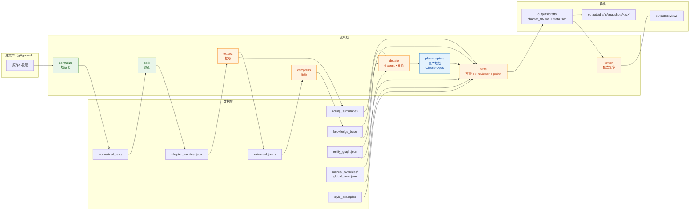

<div align="center">

# Continuator / 续

**一条用工程方法构建的多 Agent 长篇小说续写流水线。**

[English](README.md) · [简体中文](README.zh.md)

[](https://www.python.org/)
[](#%E9%A1%B9%E7%9B%AE%E7%8A%B6%E6%80%81)
[](docs/iterations/)
[](https://github.com/BerriAI/litellm)
[](#%E5%BF%AB%E9%80%9F%E5%BC%80%E5%A7%8B)

</div>

---

## TL;DR

读入一部已出版小说 → 构建结构化知识库 → 6 个 agent 辩论续写方向 → 用强推理模型规划 N 章细则 → 每章用便宜快模型生成 → 8 个 reviewer 质量把关 → **成本和质量都有数字**。

**不是**"又一个套壳 GPT"。重点不是 prompt，而是**围绕 LLM 的工程脚手架**：14 轮 mock 优先的开发、真模型验证、preflight 守门、prompt cache 感知的 writer、用于关系一致性的 entity graph、每次调用的成本遥测。

测试语料：《龙族》（江南），5 卷 230 万字。最新一章生产数据：**4507 中文字符、用户评分 8/10、单章 $0.42**。

> 原作小说本体被 gitignored。本仓库只发布引擎，不发布语料。

---

## 为什么这个项目值得点开

| 层 | 在代码里长什么样 |
|---|---|
| **Mock 优先开发** | 126 个单元测试，**3 秒跑完**，一个 token 都不烧。`tests/__init__.py` 强制 `OPENAI_MODEL=mock`，防止 `.env` 泄露污染测试。 |
| **Preflight 守门** | 真模型跑之前 7 类 FATAL 检查：env / context limit / agents 配置 / rolling state / manifest 完整性 / **provider routing** / 人工事实。 |
| **成本遥测** | 每次 LLM 调用记录 `request_hash`、prompt/response tokens、cache_read/cache_write tokens。`estimate-cost` 按 provider 单价聚合。 |
| **分段抽取** | >24k 字符的章节切前/中/末三段；**全成功才合并**，杜绝半成品摘要。 |
| **结构化辩论** | 6 agent × 6 轮自由文本 + 结构化投票（`position: agree/abstain/reject`）。多数决聚合，带平票/多数反对标记。空 ballot 有 fallback 路径。 |
| **带 timeline 的 Entity graph** | 角色/地点/概念作为 entity；关系携带 `timeline[]`，`active=true` 标记当前续写起点状态。**writer 只看 active state**；"关系一致性" reviewer agent 对照核验。当前测试图：32 entities / 33 relationships。 |
| **风格示例注入** | 用户手挑 3-5 段原作者文本，扔进 writer 的 prompt cache 段做声音模仿。 |
| **双层模型架构** | 规划：Claude Opus（强推理、贵、按 N 章跑一次）。写作：DeepSeek-V4（便宜、按章跑）。两者都走 LiteLLM 路由。 |
| **迭代日志** | [14 条](docs/iterations/)，每条含 Context / Plan / Acceptance criteria / 实测结果 / File summary。仓库本身也是一份工程日志。 |
| **快照机制** | 真模型产物自动落 `outputs/drafts/snapshots/<ts>/`，后续 mock run 不可能覆盖。 |
| **Polish pass** | 当 lint + 7 个 reviewer 都通过，但章节中文字符数仍 < 3000 时，触发集中扩写调用。 |

---

## 架构



三层执行：

- 🟩 **本地确定性** —— 文件处理，不调 LLM
- 🟧 **便宜快模型**（`deepseek/deepseek-v4-pro` 等）—— 按章跑
- 🟦 **强推理模型**（`Claude Opus`）—— 一次性出 N 章计划

---

## 快速开始

### Mock 模式 —— 不需要 API key，不联网

```bash
git clone https://github.com/ARMANDSnow/make-ur-Agent-writer.git
cd make-ur-Agent-writer
pip install -r requirements.txt
bash scripts/verify.sh
```

`verify.sh` 跑：
- 126 个单元测试
- normalize → split → extract → compress → debate → write 1 章 → review
- manifest 完整性检查
- 报告快照漂移检查
- 成本估算

全程 mock，约 30 秒。退出码 0 = 整条流水线接通无误。

### 真模型模式

```bash
cp .env.example .env
# 编辑 .env：
#   OPENAI_API_KEY=sk-...
#   OPENAI_BASE_URL=https://api.deepseek.com
#   OPENAI_MODEL=deepseek/deepseek-v4-pro
#
# 可选 planner 层（走 OpenAI 兼容路径接 Claude）：
#   PLANNER_API_KEY=...
#   PLANNER_BASE_URL=...
#   PLANNER_MODEL=openai/claude-opus-4-5

python3 main.py preflight    # 7 类 FATAL 检查；任何一项不过退出码非零
bash scripts/write_smoke.sh  # preflight → compress → debate → write 1 章 → review → snapshot
```

`scripts/write_smoke.sh` 写一章，所有产物自动落 `outputs/drafts/snapshots/<时间戳>/`。一次跑 5-15 分钟，DeepSeek-V4 单章 $0.30-$0.50。

> **换一本小说**：把你的 `.txt` 丢到 `小说txt/`（gitignored）。流水线自动识别 UTF-16 / GB18030，规范化成 UTF-8。然后写 `data/entity_graph.json` 和 `data/manual_overrides/global_facts.json`，填上你那部小说的事实。模板在 `data/entity_graph.example.json`。

---

## CLI 命令

```bash
python3 main.py <command> [options]
```

| 命令 | 作用 |
|---|---|
| `normalize` | 识别编码（UTF-16 / GB18030），规范化为 UTF-8，保留行号映射 |
| `split` | 从规范化文本构建 `chapter_manifest.json`，每条记录带确定性 `confidence ∈ [0,1]` |
| `extract` | 按章节结构化抽取。长章节自动 chunk，全成功才合并 |
| `compress` | 构建 `knowledge_base/global_knowledge.md` + `knowledge_index.json` |
| `debate` | 6 agent × 6 轮自由文本 + 结构化投票 → `outline.md` + `decisions.json` |
| `plan-chapters` | 用 Claude Opus 规划 N 章 → `chapter_plan.json` |
| `write` | 在 outline + chapter_plan 约束下生成章节。8 reviewer + lint + polish |
| `review` | 对已生成的草稿重新跑 reviewer |
| `retry-failures` | 重试 `data/extraction_failures/` 中的章节 |
| `preflight` | 只读的运行前检查；FATAL 时退出码非零 |
| `status` | 流水线状态报告 |
| `check-manifest` | 校验 `chapter_manifest.json` 完整性 |
| `check-reports` | 校验生成 Markdown 报告是否与当前 JSON 输入同步 |
| `manifest-report` | manifest 渲染成 Markdown |
| `review-summary` | reviewer 裁决与 lint 规则汇总 |
| `estimate-cost` | 成本报告（汇总日志真实 token + chunk 估算） |
| `run-all` | mock-only 全流水线快捷入口 |

### Smoke 脚本

| 脚本 | 用途 |
|---|---|
| `scripts/verify.sh` | mock-only 全流水线 sanity。强制 `OPENAI_MODEL=mock` 并 unset keys，干净仓库始终退出 0 |
| `scripts/real_smoke.sh` | preflight → extract 2 章 → preflight |
| `scripts/debate_smoke.sh` | preflight → debate → estimate-cost → preflight；快照到 `outputs/debate/snapshots/<ts>/` |
| `scripts/write_smoke.sh` | preflight → compress → debate → write 1 章 → review → snapshot |
| `scripts/write_book.sh` | 多章续写（iter 013+） |

---

## 项目结构

```
.
├── src/                          # 24 个模块，4170 行
│   ├── llm_client.py             # LiteLLM 封装：cache_control / context overflow guard / retry / request_hash
│   ├── preflight.py              # 7 类 FATAL 检查，真模型安全闸门
│   ├── extractor.py              # 分段抽取，全成功才合并
│   ├── debater.py                # 6 agent 辩论 + 结构化投票（多数决/平票/否决）
│   ├── plot_planner.py           # Claude Opus 章节规划（iter 014）
│   ├── writer.py                 # writer：style/anchor/plan 注入 + polish pass
│   ├── reviewer.py               # 8 个 reviewer agent（含 "关系一致性"）
│   ├── entities.py               # entity graph 加载 + active-state 渲染 + tag 反向索引
│   ├── linter.py                 # 确定性风格 lint，带阈值规则
│   ├── schemas.py                # Pydantic 模型，schema 唯一来源
│   └── ...
├── tests/                        # 29 个文件，2571 行，126 个测试
├── docs/
│   ├── iterations/               # 14 轮迭代日志，每条是完整工程复盘
│   ├── stage_01_summary.md       # 阶段 1：mock 优先基础
│   ├── stage_02_summary.md       # 阶段 2：首次真模型验证
│   ├── notes/                    # 调研笔记
│   └── AGENT_HANDOFF.md          # 会话延续锚点
├── config/
│   ├── agents.yaml               # 6 debate + 8 review agent + writer 配置
│   ├── models.yaml               # 按 task 的 model / temperature / max_tokens / context_limit
│   └── linter.yaml               # lint 规则与阈值
├── prompts/                      # writer / reviewer / debate / extractor 的 system prompt
├── scripts/                      # 5 个入口脚本（见上）
├── main.py                       # CLI 分发
├── data/                         # gitignored：源文本、派生数据、知识库
└── outputs/                      # gitignored：草稿、审查、辩论产物、快照
```

---

## 工程日志

仓库同时是**一份透明的"它是怎么被建出来的"记录**。每轮迭代是一个工程决策的端到端记录。

### 阶段 1 —— Mock 优先基础（iter 001-005）
[stage_01_summary.md](docs/stage_01_summary.md) · CLI 表面、可观测性、真模型加固、preflight、splitter confidence。

### 阶段 2 —— 首次真模型验证（iter 006-008）
[stage_02_summary.md](docs/stage_02_summary.md) · Provider routing FATAL、debate 结构化投票、ballot 字段修复、首次真模型 `write` smoke。

### 阶段 3 —— 写作质量轴（iter 009+）
- [009](docs/iterations/iteration_009_writing_quality_surge.md) —— 风格注入 + 时间锚点 + 长度兜底 + 多 1 次 rewrite
- [010](docs/iterations/iteration_010_polish_and_linter_thresholds.md) —— Linter 阈值化 + polish pass + reviewer 旁路安全
- [011](docs/iterations/iteration_011_entity_graph_and_consistency.md) —— **Entity graph + 一致性 reviewer**。用户评分 8/10。
- [012](docs/iterations/iteration_012_reviewer_robustness_and_consistency_strict.md) —— Reviewer JSON 鲁棒性 + debate fallback
- [013](docs/iterations/iteration_013_multi_chapter_architecture.md) —— 多章续写架构
- [014](docs/iterations/iteration_014_plot_planner.md) —— Claude Opus 章节规划

每条都遵循同一个 8 段模板：Context · Plan · Acceptance criteria · Implementation Notes · Acceptance Result · File Summary · 不在本轮范围 · Notes。Acceptance Result 里全是**实测数字**，不是承诺。

---

## 最新实测数字

| 指标 | 数值 | 来源 |
|---|---|---|
| 测试语料 | 5 卷，101 章，**2,308,674 字** | `data/chapter_manifest.json` |
| Entity graph | **32 entities, 33 relationships** | `data/entity_graph.json` |
| 生成章节长度 | **4,507 中文字符**（目标 3500-5500） | iter 011 snapshot |
| 用户质量评分 | **8 / 10** | iter 011 P7 验收 |
| 单章真模型调用次数 | 60（compress 1 + debate 47 + write 1 + review 11） | `logs/llm_calls.jsonl` |
| DeepSeek-V4 成功率 | **60/60 = 100%** | 最近一次 smoke |
| 单章成本 | **~$0.42** | 按 DeepSeek-V4 单价估算 |
| 单元测试 | **126 个，3.0 秒跑完**（mock-only） | `python3 -m unittest discover -s tests` |

---

## 技术栈

- **Python 3.9+**
- [LiteLLM](https://github.com/BerriAI/litellm) —— 多 provider 路由（OpenAI / DeepSeek / Anthropic / ...）
- [Pydantic](https://docs.pydantic.dev/) —— schema 唯一来源
- [tiktoken](https://github.com/openai/tiktoken) —— token 计数（带 `cl100k_base` 回落）
- [python-dotenv](https://github.com/theskumar/python-dotenv)

无 async、无框架锁定、无 orchestration 库。纯 Python + LLM 调用 + JSON I/O。

---

## 项目状态

✅ **阶段 1**（mock 基础）—— 完成
✅ **阶段 2**（真模型首次 smoke）—— 完成
🔄 **阶段 3**（写作质量）—— 第一阶段完成（8/10 章），多章 + plot planner 进行中
⏳ **阶段 4**（通用化）—— workspace、多语言 splitter、agent persona 抽象

当前会话延续锚点见 [docs/AGENT_HANDOFF.md](docs/AGENT_HANDOFF.md)。

---

## 范围说明

- 这是个**研究性质的工程练习**，不是产品。
- 原作小说《龙族》**不被重新分发**。`小说txt/`、`data/`、`outputs/`、`logs/` 全部被 gitignored。仓库只发布**代码、配置、prompt、文档、迭代日志** —— 仅此而已。
- 生成的续写章节是源作品的衍生作品，只保留在本地。
- 用别的小说：把 `.txt` 丢进 `小说txt/`，自己写 `entity_graph.json` 和 `global_facts.json`（模板在 `data/entity_graph.example.json` 和 `data/manual_overrides/`），同一条流水线就能跑。

---

<div align="center">

用 14 轮 *先测量，再 commit* 建出来的项目。

</div>
